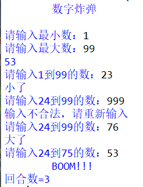

# 数字炸弹小程序简介
## 一、数字炸弹规则：
在一个数字范围内，有一个数字作为炸弹，谁猜中这个炸弹就被惩罚。比如输入的范围是1-100，随机生成的炸弹是60，然后猜了一个数字是30，30不是炸弹，那么现在猜数字的范围就缩小到30~100，又猜了一个数字80，80也不是炸弹，那么现在又缩小范围到30~80，如此往复，直到猜中这个炸弹，则触发爆炸。


## 二、代码写作思路：
### 1. 输入范围并生成炸弹
输入最小值和最大值并利用while循环判断是否输入正确，再调用random函数生成炸弹数字。   
该部分代码如下：
```python
import random
print("\t数字炸弹\n")
while 1:
    min = int(input("请输入最小数："))
    max = int(input("请输入最大数："))
    if min<max:
        break
    else:
        print("输入不合法，请重新输入")
a = random.randint(min,max)
print(a)
```

### 2. 玩家输入数字比较大小，同时调整范围
用 if 语句将玩家输入的数字b与计算机生成的炸弹数字a来比较大小；当b>a时输出太大了且max=b-1，当b<a时输出太小了且min=b+1，当 b=a时爆炸。注意输入b后应检验b是否在范围内。  
该部分代码如下：
```python
 b=int(input("请输入%d到%d的数："%(min,max)))
    if b>max or b<min:
            print("输入不合法，请重新输入")
    else:
        round+=1
        if b>a:
            print("大了")
            max=b-1
        if b<a:
            print("小了")
            min=b+1
        if b==a:
            print("\tBOOM!!!")
```
### 3. 建立循环，直至猜中炸弹后结束
设定while循环条件恒为真，在b=a后添加break语句，使得猜中炸弹后跳出循环。  
即在2.中的代码前后分别添加两个语句：
```python
while 1: #前
break #后
```
### 4. 添加回合数
创建一个变量来统计循环次数，初值为“0”，在每次循环前变量+1即可。  
相关语句：
```python
round=0

round+=1

print("回合数=%d"%round)
```   

## 三、最终代码：
```python
import random
print("\t数字炸弹\n")
while 1:
    min = int(input("请输入最小数："))
    max = int(input("请输入最大数："))
    if min<max:
        break
    else:
        print("输入不合法，请重新输入")
a = random.randint(min,max)
print(a)
round=0
while 1:
    b=int(input("请输入%d到%d的数："%(min,max)))
    if b>max or b<min:
            print("输入不合法，请重新输入")
    else:
        round+=1
        if b>a:
            print("大了")
            max=b-1
        if b<a:
            print("小了")
            min=b+1
        if b==a:
            print("\tBOOM!!!")
            break
print("回合数=%d"%round)
```
## 四、运行效果：



